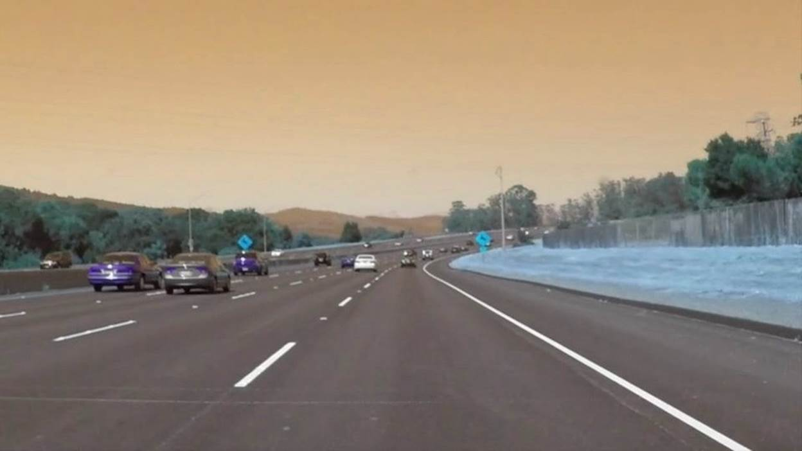
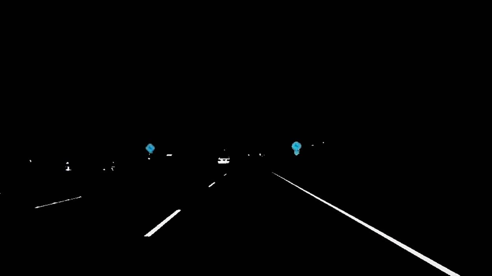
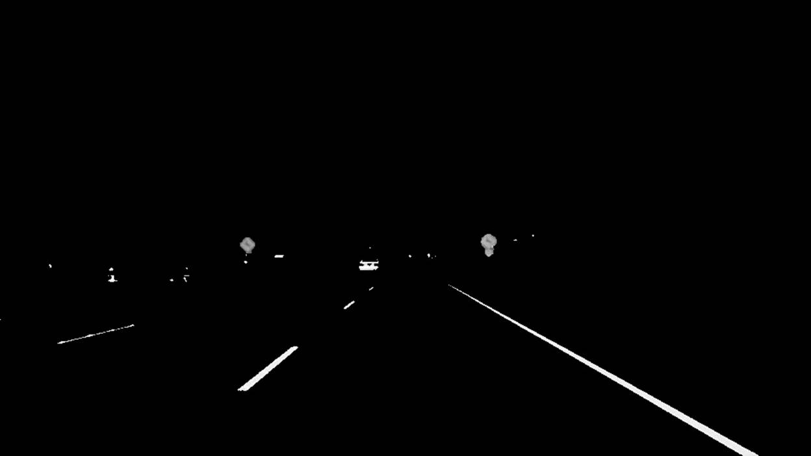
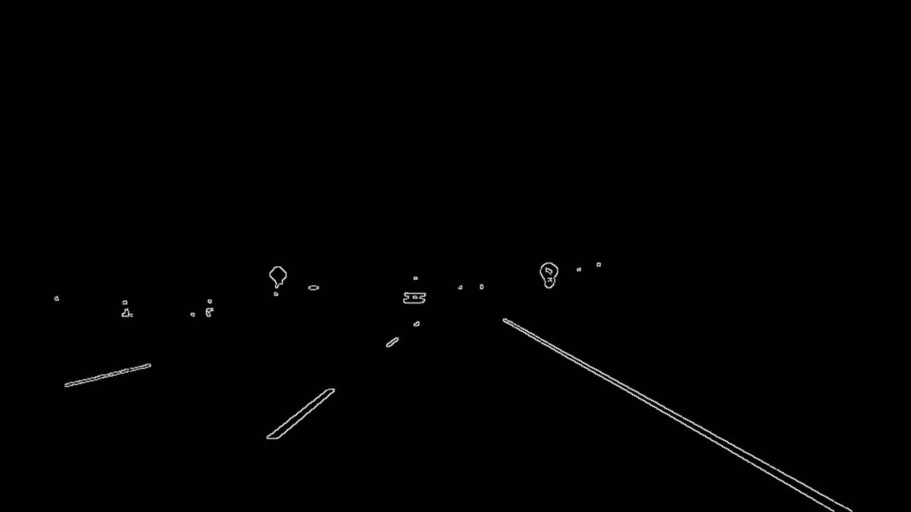
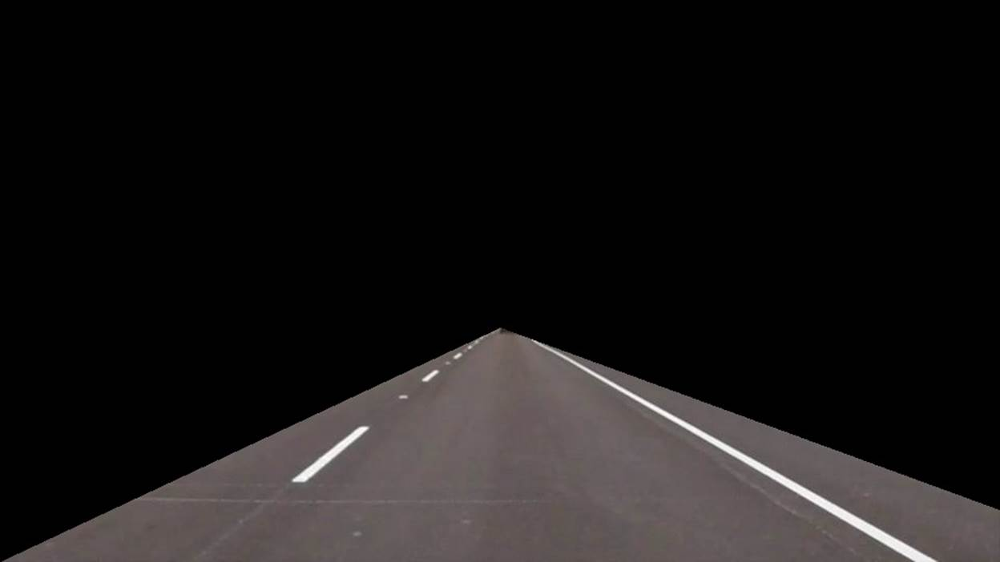
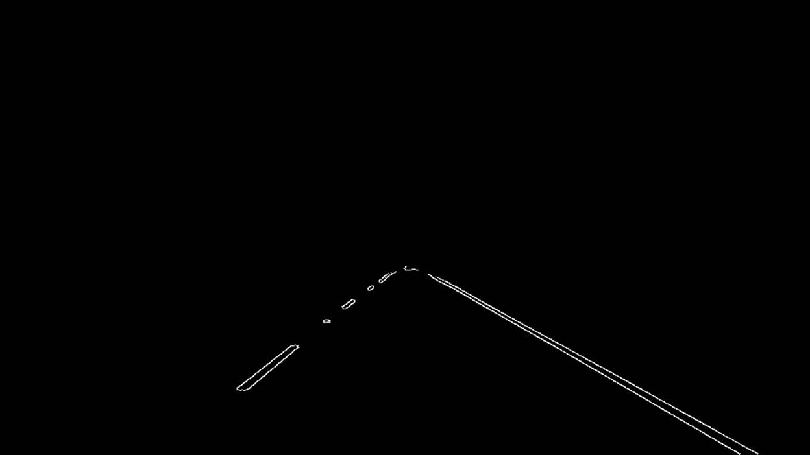
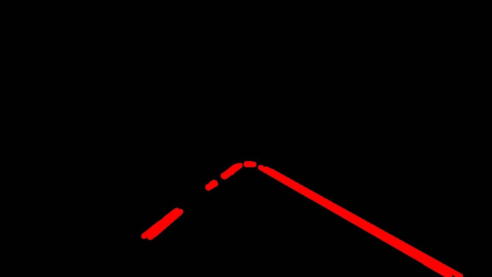
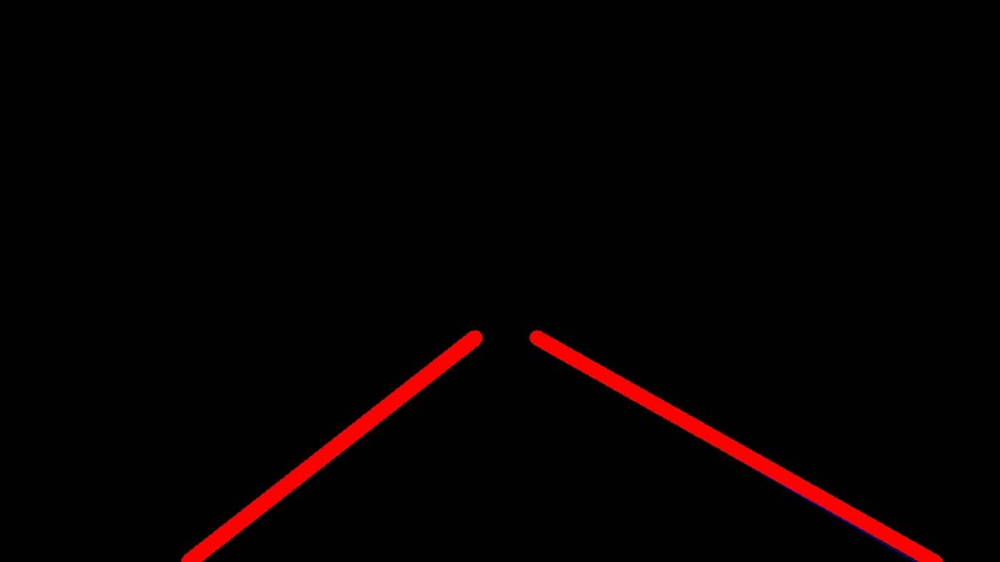
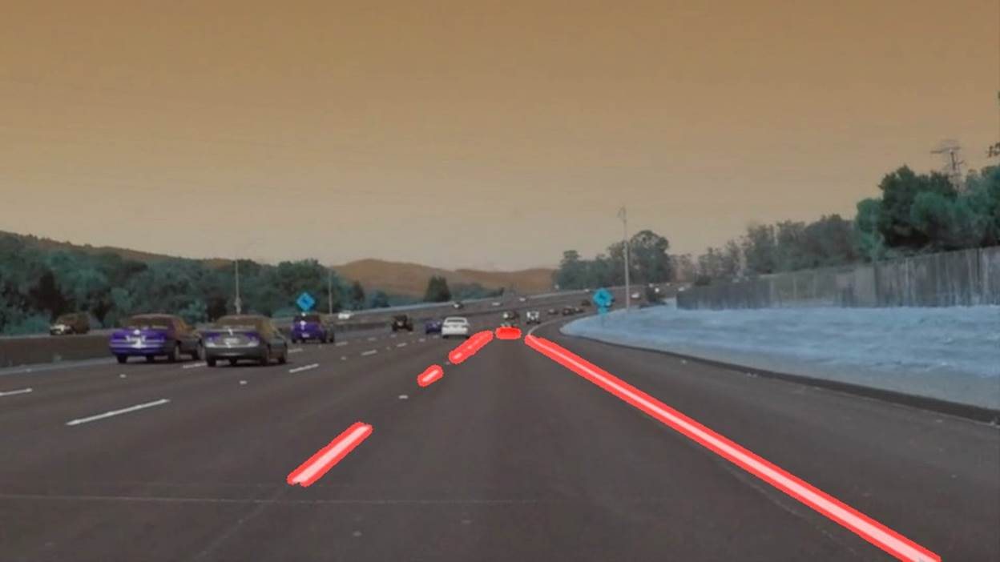

# **Finding Lane Lines on the Road**

 

 

In this project, We have to use Python and OpenCV to find lane lines in the road images.  Now, let us consider the below image as the input and then try to find the lane lines in it.

 

**Fig1:** Original image

 

My pipeline to process the image consisted of the following: 

 

**1.**     **Color Selection:** 

As you can see there are different colors in the road, but we are mainly interested in white or yellow lane colors. So, it is good to filter the image to contain only those two colors.

 

def filter_colors(image):

​    """

​    Filter the image to include only yellow and white pixels

​    """

​    \# Filter white pixels

​    white_threshold = 200

​    lower_white = np.array([white_threshold, white_threshold, white_threshold])

​    upper_white = np.array([255, 255, 255])

​    white_mask = cv2.inRange(image, lower_white, upper_white)

​    white_image = cv2.bitwise_and(image, image, mask=white_mask)

 

​    \# Filter yellow pixels

​    hsv = cv2.cvtColor(image, cv2.COLOR_BGR2HSV)

​    lower_yellow = np.array([90,100,100])

​    upper_yellow = np.array([110,255,255])

​    yellow_mask = cv2.inRange(hsv, lower_yellow, upper_yellow)

​    yellow_image = cv2.bitwise_and(image, image, mask=yellow_mask)

 

​    \# Combine the two above images

​    image2 = cv2.addWeighted(white_image, 1., yellow_image, 1., 0.)

​    return image2

 

**Fig2:** Filtered image

 

**2.**     **Grayscaling the image:**

Grayscale is important as it is helpful in edge detection 

def grayscale():

​    """Applies the Grayscale transform

​    This will return an image with only one color channel

​    but NOTE: to see the returned image as grayscale

​    (assuming your grayscaled image is called 'gray')

​    you should call plt.imshow(gray, cmap='gray')"""

​    return cv2.cvtColor(, cv2.COLOR_RGB2GRAY)

**Fig3:** Grayscale image

  

**3.**     **Canny Edge Detection:**

I used the API from opencv (cv2.canny) to detect edges of an image. However, internally what it does is that it provides a Gaussian smoothing, calculates the gradient and does a non maximum suppression with interpolation on the provided image. The provided inputs to this API contains low and high threshold which needs to be tweaked to get the best results.

 

def canny(, low_threshold, high_threshold):

​    """Applies the Canny transform"""

​    return cv2.Canny(, low_threshold, high_threshold)

**Fig4:** Edge Detection

 

**4.**     **Region of Interest:**

Once the edges are detected from the image, the region which we are interested in needs to be selected and masked so that the lanes only in which the car is travelling will be annotated.

 

def region_of_interest(, vertices):

​    """

​    Applies an image mask.

 

​    Only keeps the region of the image defined by the polygon

​    formed from `vertices`. The rest of the image is set to black.

​    `vertices` should be a numpy array of integer points.

​    """

​    \# defining a blank mask to start with

​    mask = np.zeros_like()

 

​    \# defining a 3 channel or 1 channel color to fill the mask with depending on the input image

​    if len(.shape) > 2:

​        channel_count = .shape[2]  # i.e. 3 or 4 depending on your image

​        ignore_mask_color = (255,) * channel_count

​    else:

​        ignore_mask_color = 255

 

​    \# filling pixels inside the polygon defined by "vertices" with the fill color

​    cv2.fillPoly(mask, vertices, ignore_mask_color)

 

​    \# returning the image only where mask pixels are nonzero

​    masked_image = cv2.bitwise_and(, mask)

​    return masked_image

**Fig5:** Region of Interest on the original image

**Fig6:** Region of Interest selected on the edge image

 

**5.**     **Hough Transform Line detection:**

Now, in order to detect and then draw the lines on the actual lanes, Hough transformation is required. A line in image space will be a point in Hough space which is nothing but a graph of slope vs y intercept. This can be found again by the opencv API HoughLineP. However, the parameters needs to be tweaked to achieve the best results. 

The output of Hough transformation are then passed to one of the below type:

 

def hough_lines(, rho, theta, threshold, min_line_len, max_line_gap, color=[0, 0, 255]

​                , thickness=10, extrapolate=False):

​    """

​    `` should be the output of a Canny transform.

 

​    Returns an image with hough lines drawn.

​    """

​    lines = cv2.HoughLinesP(, rho, theta, threshold, np.array([]), minLineLength=min_line_len,

​                            maxLineGap=max_line_gap)

​    line_img = np.zeros((.shape[0], .shape[1], 3), dtype=np.uint8)

​    draw_lines(line_img, lines, color, thickness, extrapolate)

​    return line_img

 

a. The output of this is then passed to draw a red colored line on those output lines as below which is easy with the help of line API.

**Fig7:** Lines drawn on a blank image

 

b.     However, there was also a requirement to average/extrapolate these lines which would then look as below. To extrapolate, first we need to find the center of the image which would then help to identify the lines as they are left/right side lines. Then, average out the slope of all line segments in a lane
 and then, extrapolate a line from the bottom of the frame to the center for both left and right lanes. Now, draw a line from the bottom of the lane to the top.

 

def draw_lines(, lines, color, thickness, extrapolate=False):

​    """

​    NOTE: this is the function you might want to use as a starting point once you want to

​    average/extrapolate the line segments you detect to map out the full

​    extent of the lane (going from the result shown in raw-lines-example.mp4

​    to that shown in P1_example.mp4).

 

​    Think about things like separating line segments by their

​    slope ((y2-y1)/(x2-x1)) to decide which segments are part of the left

​    line vs. the right line.  Then, you can average the position of each of

​    the lines and extrapolate to the top and bottom of the lane.

 

​    This function draws `lines` with `color` and `thickness`.

​    Lines are drawn on the image inplace (mutates the image).

​    If you want to make the lines semi-transparent, think about combining

​    this function with the weighted_img() function below

​    """

 

​    if extrapolate:

​        y_size, x_size, _ = .shape

 

​        \# Find the center

​        center_x = x_size / 2

 

​        \# Lines which start from left of the center is considered as left lines

​        left_lines = lines[lines[:, 0, 0] <= center_x]

 

​        \# Lines which start from right of the center is considered as right lines

​        right_lines = lines[lines[:, 0, 2] > center_x]

 

​        \# average out the slope of all line segments in a lane

​        \# and then draw an line from the bottom of the lane to the top

​        left_lane_eq = find_avg_slope_intercept(left_lines)

​        right_lane_eq = find_avg_slope_intercept(right_lines)

 

​        \# extrapolate a line from the bottom of the frame to the center

​        left_lane = find_points_from_eq(left_lane_eq, y_size, y_size * 0.6)

​        right_lane = find_points_from_eq(right_lane_eq, y_size, y_size * 0.6)

 

​        \# Draw both the lines on the image

​        cv2.line(, left_lane[0], left_lane[1], color, thickness)

​        cv2.line(, right_lane[0], right_lane[1], color, thickness)

​    else:

​        for line in lines:

​            for x1, y1, x2, y2 in line:

​                cv2.line(, (x1, y1), (x2, y2), color, thickness)

​     return 

 

**Fig8:** Extrapolated lines

 

**6.**     **Combine original image with the drawn lines:**

Now, since the lines are detected and drawn on a blank image, the same lines are drawn on the original image with the help of opencv API addWeighted to obtain an annotated image as below.

 

def weighted_img(, initial_img, α=0.8, β=1., γ=0.):

​    """

​    `` is the output of the hough_lines(), An image with lines drawn on it.

​    Should be a blank image (all black) with lines drawn on it.

 

​    `initial_img` should be the image before any processing.

 

​    The result image is computed as follows:

 

​    initial_img * α +  * β + γ

​    NOTE: initial_img and  must be the same shape!

​    """

​    return cv2.addWeighted(initial_img, α, , β, γ)

 

**Fig9:** Combined image without extrapolation

 

**Fig10:** Combined image after extrapolation

  

Now, that it is working for images, it should as well work fine with the video which is nothing but a series of images. Below is the code and parameters I chose to get this working. 

 

def process_image(image):
    """
    Takes the image as parameter and then
processes it as follows. It converts the image
    to grayscale, does a guassian
smoothing on this grayed image, does a canny edge
    detection on the smoothened image,
masks the edges on the defined region of interest,
    does a hough transform to the masked
edges and draws the lines on it. The output
    lines are finally combined with the
original image to produce the processed line
    detected image
    """

    filtered_image =
filter_colors(image)
    gray = grayscale(filtered_image)

    # Define a kernel size and apply
Gaussian smoothing
    kernel_size = 15
    blur_gray = gaussian_blur(gray,
kernel_size)

    # Define the parameters for Canny
    low_threshold = 50
    high_threshold = 200
    edges = canny(blur_gray,
low_threshold, high_threshold)

    # Define the vertices for the region
of interest
    rows, cols = image.shape[:2]
    vertices = np.array([[[cols * 0.1,
rows * 0.95], [cols * 0.4, rows * 0.6],
                          [cols * 0.6,
rows * 0.6], [cols * 0.9, rows * 0.95]]], dtype=np.int32)

    masked_edges =
region_of_interest(edges, vertices)

    # Parameters for Hough transform
    rho = 1
    theta = np.pi / 180
    threshold = 20#4
    min_line_length = 20#10
    max_line_gap = 300#1#1#0

    # Run Hough on edge detected image
and also draw lines on the image
    line_image =
hough_lines(masked_edges, rho, theta, threshold, min_line_length, max_line_gap,
color=[255, 0, 0],
                             thickness=5,
extrapolate=True)

    # Make a copy of the original image
    image_copy = np.copy(image)

    # Draw the lines on the edge image
    combo = weighted_img(line_image,
image_copy, 0.8, 1, 0)

    return combo

**NOTE:** Whenever the global variable - **g_extrapolate** is made equal to **True**, only then the extrapolation part of draw line will be activated

  

**Conclusion:**

The project was successful in that the images clearly show the lane lines are detected properly and lines are very smoothly handled.

 However, on the video stream, there are very minor glitches because of the averaging and needs improvement.

 

**Improvements:**

This project would work fine for straight lines, however when there are ups or when there are huge curvatures, it might fail. It also is not working completely for the challenge video, so improvement in the code is definitely required to make it work. Some of the factors which might be affecting the lane detection can be weather, brightness, quality of road surface and so on. It might work better by using images from infrared cameras or/and by adding an outlier reduction approach like RANSAC on the hough lines or/and by using curve fitting to plot the curve instead of straight lines

 

**References:**

In order to understand the concepts better, I had a look at the following websites:

· https://medium.com/@esmat.anis/robust-extrapolation-of-lines-in-video-using-linear-hough-transform-edd39d642ddf  
· https://peteris.rocks/blog/extrapolate-lines-with-numpy-polyfit/  
· https://github.com/naokishibuya/car-finding-lane-lines  
· https://github.com/fighting41love/Udacity_Lane_line_detection  
· [Finding Lane Lines on the Road](https://medium.com/@a.siddiqui/finding-lane-lines-on-the-road-dc5a2b2a31a4)  
· [OpenCV      101: A Practical Guide to the Open Computer Vision Library](https://www.youtube.com/watch?v=jKtQxvzp1A0)  
· [Introduction to Computer Vision With OpenCV and      Python](https://dzone.com/articles/introduction-to-computer-vision-with-opencv-and-py)  
· [Finding Lane Lines on the Road, Getting started      with OpenCV](http://gear.github.io/2017-02-26-basic-lane-detection/)  
· [RANSAC Tutorial](http://www.math-info.univ-paris5.fr/~lomn/Cours/CV/SeqVideo/Material/RANSAC-tutorial.pdf)   
· [RANSAC for Dummies](http://www.cs.tau.ac.il/~turkel/imagepapers/RANSAC4Dummies.pdf)  
· [Lane detection and tracking using B-Snake](http://citeseerx.ist.psu.edu/viewdoc/download?doi=10.1.1.106.6644&rep=rep1&type=pdf)  

 